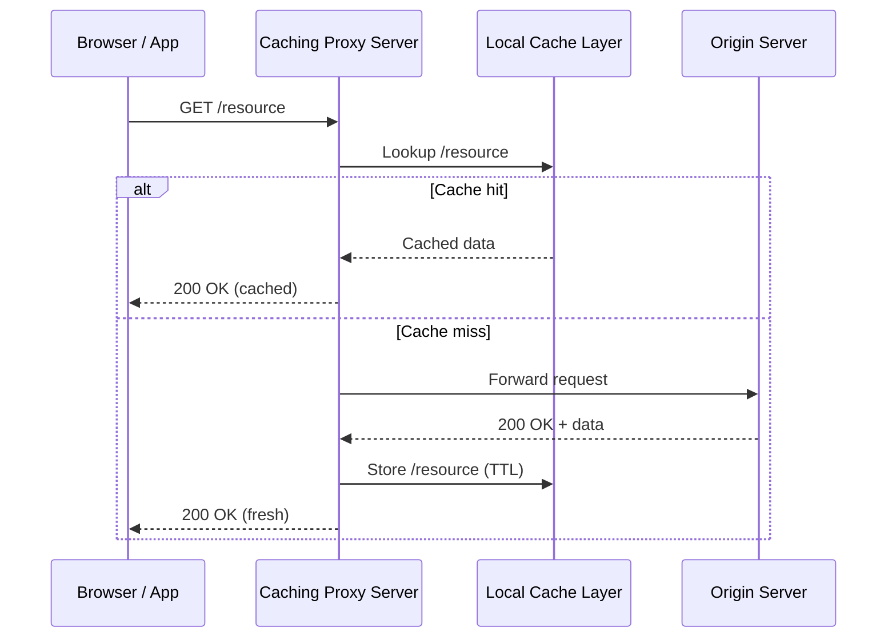

# Caching Proxy Server (TypeScript)

🔗 [https://github.com/COZYTECH/CACHING-PROXY-SERVER-TS](https://github.com/COZYTECH/CACHING-PROXY-SERVER-TS)

A **TypeScript‑based HTTP caching proxy server** that intermediates client requests, caches responses, and serves cached data when available — boosting response performance and reducing upstream load. ([Spiegato][2])

---

<p align="center">
  
</p>

---

## 🚀 Executive Summary

A **caching proxy** acts as an intermediary between clients and origin servers: it *checks cache first* and returns cached data when possible, reducing response times and bandwidth usage. ([DevX][3])

This project:

* Uses **TypeScript** for strong typing, clarity, and maintainability
* Implements a cache layer for HTTP responses
* Improves latency and efficiency on frequently requested assets
* Serves as both tooling and middleware for accelerated HTTP services

---

## 🧠 Core Purpose

Caching proxies optimize performance by storing frequently accessed resources so that repeated requests don’t require a new fetch from the origin server. This is especially valuable for APIs or static content that sees repeated similar traffic. ([Spiegato][2])

---

## 🛠 Key Features

* **Proxy request interception**
* **Cache lookup & serve** (cache‑first strategy)
* **HTTP forwarding & origin fetch fallback**
* **Cache validation & TTL support**
* **TypeScript with strong type safety**

---

## 📦 Tech Stack

* **TypeScript**
* **Node.js**
* HTTP Proxy logic
* In‑memory / disk cache (configurable)
* Optional: Redis / external cache (for scaling)

---

## 🧩 Sequence Diagram: Request & Cache Flow



---

## 📌 How It Works

1. **Request Interception:**
   The proxy receives client HTTP requests.

2. **Cache Lookup:**
   It checks its internal cache for the requested resource.

   * If a **cache hit**, return immediately.
   * If a **miss**, proxy to origin.

3. **Origin Fetch & Cache:**
   If cache doesn’t have the resource:

   * Fetch from origin server
   * Store response in cache with TTL/expiry
   * Send response back to client

4. **TTL & Eviction:**
   Cached entries expire based on TTL policies or max cache size.

This greatly reduces repeated traffic to the origin, lowering latency and bandwidth. ([DevX][3])

---

## ⚙ Installation & Usage

```bash
git clone https://github.com/COZYTECH/CACHING-PROXY-SERVER-TS
cd CACHING-PROXY-SERVER-TS
npm install
npm run build
npm start
```

By default the server listens on a configurable port (e.g., `PORT=3000`).

Clients can then point HTTP requests through this proxy:

```bash
curl http://localhost:3000/api/users
```

---

## 🔐 Caching Considerations

Out‑of‑the‑box caching proxies should respect HTTP cache headers (`Cache‑Control`, `ETag`, `Expires`) to know when to serve stale content or revalidate. ([squidproxies.com][4])

This implementation leverages TTL and basic validation logic for cached entries.

---

## ⚙ Environment Variables (.env)

```
PORT=3000
CACHE_TTL=600
CACHE_MAX_SIZE=500
```

---

## 🧠 Senior Engineering Decisions

* **TypeScript for type safety:** Strong guarantees and better developer experience.
* **Cache‑first strategy:** Reduces origin load and improves response time.
* **Middleware‑style proxy:** Makes architecture future‑proof for plugin layers (auth, rate limiting).
* **Extensible cache backends:** Replace in‑memory with Redis or filesystem for scale.

---

## 📈 Use Cases

* API gateways that cache expensive responses
* Microservice clusters with repeated similar requests
* Front‑end proxies for static assets
* Edge caching before application servers

---

## 📦 Example Proxy Request

### Request

```bash
curl -x http://localhost:3000 https://jsonplaceholder.typicode.com/posts/1
```

### Proxy Logic

* Lookup cache for `/posts/1`
* Cache miss → fetch from origin
* Store in cache
* Serve response

**Subsequent requests will hit cache first**, speeding up response times. ([Spiegato][2])

---

## 🏗 Future Enhancements

* **Support HTTP/2 & HTTPS caching**
* **Distributed cache support (Redis/Cluster)**
* **Smart revalidation based on headers**
* **Cache eviction policies (LRU, LFU)**
* **Metrics & telemetry (cache hit ratios, TTL logs)**

---

## 👤 Author

**Arigi Adinoyi Samuel**
Senior Backend & Full‑Stack | DevOps Engineer
GitHub: [https://github.com/cozytech](https://github.com/cozytech)
